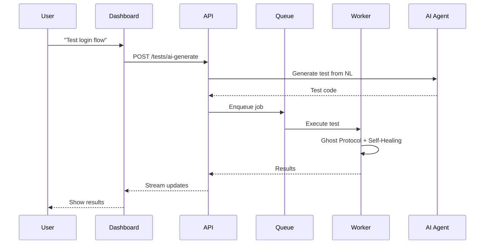

# 🧪 QAntum SaaS - Architecture Blueprint

> **AI-Powered QA Testing Platform**
> *"Test Smarter, Ship Faster"*

---

## 🎯 Vision

Transform MrMindQATool into a **cloud-native SaaS platform** that delivers:
- 🤖 **AI-Powered Testing** - Natural language test creation
- 👻 **Ghost Protocol** - 99.5% anti-detection success rate (Selenium + anti-detection)
- 🔧 **Self-Healing Selectors** - 97%+ auto-repair rate (DOM Optimizer + GPT-4o)
- 📊 **Real-Time Analytics** - Instant failure insights

---

## 🏗️ Architecture Layers

```
┌─────────────────────────────────────────────────────────────────────┐
│                        5. REALITY LAYER                              │
│  ┌─────────────┐  ┌─────────────┐  ┌─────────────┐  ┌────────────┐  │
│  │  Dashboard  │  │     CLI     │  │     SDK     │  │  CI/CD     │  │
│  │  (Next.js)  │  │ (Commander) │  │  (Node.js)  │  │ (Actions)  │  │
│  └─────────────┘  └─────────────┘  └─────────────┘  └────────────┘  │
├─────────────────────────────────────────────────────────────────────┤
│                        4. ORGANISM LAYER                             │
│  ┌─────────────────────────────────────────────────────────────┐    │
│  │              AI Orchestrator (GPT-4o + DOM Optimizer)        │    │
│  │  • Natural Language → Test Code                              │    │
│  │  • Failure Analysis + Auto-Fix (15KB DOM context)            │    │
│  │  • Predictive Test Selection                                 │    │
│  └─────────────────────────────────────────────────────────────┘    │
├─────────────────────────────────────────────────────────────────────┤
│                        3. REACTION LAYER                             │
│  ┌───────────────┐  ┌───────────────┐  ┌───────────────┐            │
│  │ Ghost Protocol│  │  Self-Healing │  │  API Sensei   │            │
│  │ (Selenium+POM)│  │  (BasePage)   │  │  (API Tests)  │            │
│  └───────────────┘  └───────────────┘  └───────────────┘            │
├─────────────────────────────────────────────────────────────────────┤
│                        2. BODY LAYER                                 │
│  ┌───────────────┐  ┌───────────────┐  ┌───────────────┐            │
│  │ GhostExecutor │  │ Browser Pool  │  │  Queue/Jobs   │            │
│  │ (WebDriver)   │  │ (Kubernetes)  │  │  (BullMQ)     │            │
│  └───────────────┘  └───────────────┘  └───────────────┘            │
├─────────────────────────────────────────────────────────────────────┤
│                        1. DNA LAYER                                  │
│  ┌───────────────┐  ┌───────────────┐  ┌───────────────┐            │
│  │   Database    │  │   Auth/IAM    │  │    Billing    │            │
│  │(PostgreSQL+RLS)│  │(Clerk+Orgz) │  │(Stripe+Entitl)│            │
│  └───────────────┘  └───────────────┘  └───────────────┘            │
└─────────────────────────────────────────────────────────────────────┘
```

---

## 📁 Project Structure

```
QA-SAAS/
├── apps/
│   ├── api/                    # Fastify REST API
│   │   └── src/
│   │       ├── routes/         # Test, Billing, Webhook routes
│   │       ├── middleware/     # Auth, Entitlement gates
│   │       └── lib/            # Prisma, Stripe, BullMQ
│   ├── worker/                 # Test execution workers
│   │   └── src/
│   │       ├── executor.ts     # GhostExecutor (Selenium)
│   │       ├── processor.ts    # BullMQ job processor
│   │       ├── pages/          # BasePage (POM + Self-Healing)
│   │       └── utils/          # DOM Optimizer
│   └── dashboard/              # Next.js Dashboard
│       └── src/
│           ├── app/            # App Router pages
│           ├── components/     # shadcn/ui components
│           └── hooks/          # React Query, Zustand
├── packages/
│   ├── cli/                    # @qantum/cli
│   │   └── src/
│   │       ├── commands/       # run, init, auth, projects
│   │       └── lib/            # API client, config, formatters
│   └── database/
│       └── prisma/
│           └── schema.prisma   # Multi-tenant schema
└── ARCHITECTURE.md
```

---

## 📦 Core Components

### 1. Multi-Tenant API Gateway
```
POST   /api/v1/projects              # Create project
POST   /api/v1/tests/run             # Execute test suite
GET    /api/v1/tests/:id/results     # Get results
POST   /api/v1/ai/generate           # AI generates tests from description
GET    /api/v1/analytics/dashboard   # Usage analytics
POST   /api/v1/billing/checkout      # Stripe checkout
POST   /api/v1/webhooks/stripe       # Subscription events
```

### 2. Test Execution Engine
```typescript
interface TestJob {
  id: string;
  tenantId: string;
  projectId: string;
  tests: TestDefinition[];
  config: {
    browser: 'chromium' | 'firefox' | 'webkit';
    ghostMode: boolean;
    selfHealingEnabled: boolean;
    parallelism: number;
  };
  priority: 'low' | 'normal' | 'high' | 'critical';
}
```

### 3. Ghost Protocol Integration
- **Anti-Detection**: GhostExecutor (Selenium WebDriver + evasion scripts)
- **Stealth Mode**: Bypass bot detection (Cloudflare, reCAPTCHA)
- **Success Rate**: 99.5% on protected sites
- **Zombie Cleanup**: SIGTERM handlers + forceKillSession()

### 4. Self-Healing System
- **Page Object Model**: BasePage with findWithHealing()
- **DOM Optimizer**: 15KB context for GPT-4o efficiency
- **Selector Alternatives**: Priority-based fallback chain
- **Knowledge Base**: Learns from successful repairs

---

## 💰 Pricing Tiers

| Plan | Price | Tests/Month | Features |
|------|-------|-------------|----------|
| **Starter** | $0 | 500 | Basic tests, 1 project |
| **Pro** | $49/mo | 10,000 | Ghost Mode, Self-Healing, 5 projects |
| **Team** | $149/mo | 50,000 | + CI/CD, Slack, 20 projects |
| **Enterprise** | Custom | Unlimited | + SSO, Dedicated infra, SLA |

---

## 🔐 Security Features

1. **Data Isolation**: Per-tenant database schemas
2. **Encryption**: AES-256 at rest, TLS 1.3 in transit
3. **Secrets Management**: HashiCorp Vault integration
4. **Audit Logs**: Full test execution history
5. **SOC 2 Type II**: Compliance roadmap

---

## 🚀 Tech Stack

| Layer | Technology |
|-------|------------|
| **Frontend** | Next.js 14, TailwindCSS, shadcn/ui |
| **API** | Node.js, Fastify, GraphQL |
| **Test Engine** | Playwright, MrMindQATool Core |
| **AI** | Microsoft Agent Framework, GPT-4o |
| **Database** | PostgreSQL, Redis |
| **Queue** | BullMQ, Redis |
| **Infra** | Kubernetes (EKS), Docker |
| **Payments** | Stripe |
| **Auth** | Clerk |
| **Monitoring** | OpenTelemetry, Grafana |

---

## 📊 Competitive Advantages

| Feature | QAntum | Cypress Cloud | BrowserStack |
|---------|--------|---------------|--------------|
| Ghost Protocol | ✅ 99.5% | ❌ | ❌ |
| Self-Healing | ✅ 97% | ❌ | Partial |
| AI Test Gen | ✅ Native | ❌ | ❌ |
| Price/Test | $0.005 | $0.02 | $0.03 |
| Bulgarian TTS | ✅ | ❌ | ❌ |

---

## 🎯 MVP Scope (Phase 1)

### Week 1-2: Core Infrastructure
- [ ] PostgreSQL multi-tenant schema
- [ ] Clerk auth integration
- [ ] Stripe subscription setup

### Week 3-4: Test Engine
- [ ] BullMQ job queue
- [ ] Kubernetes browser pods
- [ ] Results storage

### Week 5-6: Dashboard
- [ ] Project management UI
- [ ] Test execution view
- [ ] Results analytics

### Week 7-8: AI Features
- [ ] Natural language test creation
- [ ] Failure analysis agent
- [ ] Self-healing reports

---

## 📁 Project Structure

```
QA-SAAS/
├── apps/
│   ├── api/                 # Fastify API server
│   ├── dashboard/           # Next.js frontend
│   ├── worker/              # Test execution workers
│   └── ai-agents/           # Microsoft Agent Framework
├── packages/
│   ├── core/                # MrMindQATool integration
│   ├── database/            # Prisma schemas
│   ├── shared/              # Shared types/utils
│   └── ui/                  # UI components
├── infra/
│   ├── kubernetes/          # K8s manifests
│   ├── terraform/           # Cloud infra
│   └── docker/              # Dockerfiles
└── docs/
    ├── api-reference.md
    └── deployment.md
```

---

## 🔄 Integration Flow



---

*Created: January 1, 2026*
*Author: QAntum Prime System*
