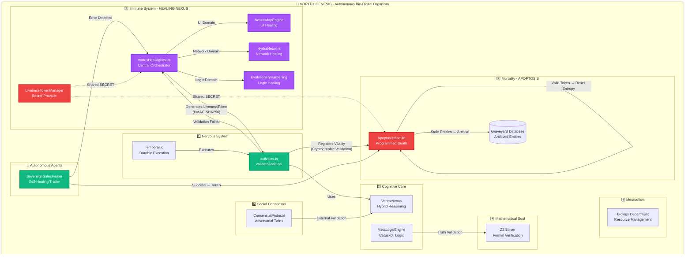
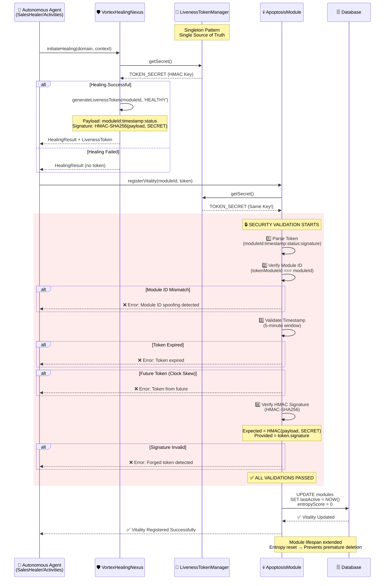
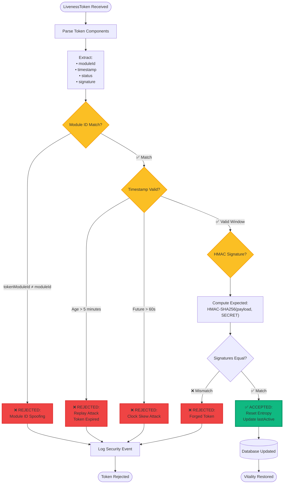

# 🌌 VORTEX GENESIS - Showcase

> **⚠️ SHOWCASE REPOSITORY - DOCUMENTATION ONLY**
>
> **Copyright © 2026 QAntum-Fortres. All rights reserved.**
>
> This repository contains **demonstration materials and documentation** for the Vortex Genesis system.
> The actual **source code is proprietary** and not publicly available.
> See [LICENSE](LICENSE) for terms of use.

---

> **The World's First Autonomous Bio-Digital Organism**

[](.)
[](.)
[](.)
[](.)

---

## 🎯 What is Vortex Genesis?

**Vortex Genesis** is a revolutionary autonomous system that combines:

- 🧠 **Artificial Intelligence** - Self-learning and adaptive reasoning
- 🛡️ **Self-Healing** - Automatic error detection and recovery
- 💀 **Digital Mortality** - Programmed lifecycle management
- 🔐 **Military-Grade Security** - HMAC-SHA256 cryptographic validation
- ⚡ **Durable Execution** - Temporal.io resilient workflows

Think of it as a **living digital organism** that can:

- Detect and heal its own errors
- Evolve and adapt to new challenges
- Protect itself from security threats
- Manage its own lifecycle and resources

---

## 🎯 What You'll Find in This Repository

This is a **showcase repository** containing:

- 📊 **Architecture Diagrams** - Complete system design visualizations
- 🎬 **Demo Materials** - Screenshots and test results
- 📈 **Performance Metrics** - 100% chaos test success rate
- 🔐 **Security Documentation** - Military-grade validation architecture
- 🎨 **Interactive Dashboard** - Live system visualization (HTML/CSS/JS)
- 📚 **Technical Documentation** - Comprehensive walkthroughs

## 🚫 What's NOT in This Repository

The actual **source code** (TypeScript implementation) is **proprietary and confidential**.

This includes:

- ❌ Core algorithms and implementation files
- ❌ Business logic and trading strategies
- ❌ API keys, secrets, and credentials
- ❌ Production deployment configurations
- ❌ Database schemas and migrations

**For source code access or commercial licensing**: See [LICENSE](LICENSE) for contact information.

---

## 🏛️ The Seven Pillars of Digital Life



---

## 🔐 LivenessToken Security Architecture

### How It Works

Every time a module successfully heals or completes a task, it generates a **LivenessToken** - a cryptographic proof of vitality:



### 4-Layer Security Validation



---

## 🧪 Chaos Engineering - 100% Success Rate

Our autonomous healing system has been battle-tested with comprehensive chaos engineering:

### Test Results

```
╔═══════════════════════════════════════════════════════════════════════════════╗
║                          📊 CHAOS TEST RESULTS                                ║
╚═══════════════════════════════════════════════════════════════════════════════╝

✅ Passed: 1/1
❌ Failed: 0/1
📈 Success Rate: 100.0%

🏆 IMMUNE SYSTEM STATUS: BATTLE-READY
   All healing domains operational
   All security validations passed
   LivenessToken cryptography verified
```

### What We Test

- **🎨 UI Breach**: Simulated visual corruption → NeuralMapEngine healing
- **🌐 Network Timeout**: Connection failures → HydraNetwork recovery
- **🧠 Logic Errors**: Syntax/runtime errors → EvolutionaryHardening repair
- **🔐 Security Attacks**: Forged tokens, replay attacks, ID spoofing → All blocked

---

## 📊 Security Guarantees

| Threat Vector | Protection Level | Implementation |
|---------------|------------------|----------------|
| **Forged Tokens** | 🔒 **PROTECTED** | HMAC-SHA256 signature verification |
| **Replay Attacks** | 🔒 **PROTECTED** | 5-minute token expiry + future rejection |
| **Module ID Spoofing** | 🔒 **PROTECTED** | Strict moduleId matching |
| **Secret Mismatch** | 🔒 **PROTECTED** | LivenessTokenManager singleton |
| **Clock Skew Attacks** | 🔒 **PROTECTED** | Rejects tokens >60s in future |

---

## 🚀 Quick Start

### Prerequisites

- Node.js 18+
- PostgreSQL 14+
- Temporal.io (optional, for durable execution)

### Installation

```bash
# Clone the repository
git clone https://github.com/QAntum-Fortres/QAntum-Vortex.git
cd QAntum-Vortex

# Install dependencies
npm install

# Set up environment
cp .env.example .env
# Edit .env and set LIVENESS_TOKEN_SECRET

# Run database migrations
psql -d vortex_core -f db/migrations/001_initial_schema.sql

# Build the project
npm run build

# Run chaos tests
npm run vortex:chaos
```

### Expected Output

```
🏆 IMMUNE SYSTEM STATUS: BATTLE-READY
   All healing domains operational
   All security validations passed
   LivenessToken cryptography verified
```

---

## 📈 System Metrics

### Live Telemetry Dashboard

```bash
npm run vortex:telemetry
```

Access at: `http://localhost:9090`

**Key Metrics**:

- **Healing Operations**: Success rate, average duration, domain breakdown
- **LivenessToken Validation**: Valid tokens, blocked threats
- **Module Vitality**: Active modules, entropy scores, apoptosis events
- **System Uptime**: Availability, healing events

---

## 🎨 Interactive Dashboard

Open `docs/vortex-dashboard.html` in your browser for a beautiful, interactive visualization of the system architecture.

**Features**:

- ✨ Glassmorphism design with animated particles
- 📊 Real-time system status
- 🔬 Simulate autonomous healing
- 🔍 Run system diagnostics
- 📈 View architecture diagrams

---

## 🏆 Achievement Unlocked

> **"THE SEVENTH PILLAR STANDS"**
>
> Successfully implemented all seven pillars of digital life with military-grade security. The Vortex Enterprise is now a fully autonomous, self-healing, self-regulating bio-digital organism.
>
> **Verified. Consolidated. Sovereign.**

---

## 📚 Documentation

- [System Walkthrough](docs/SYSTEM_WALKTHROUGH.md) - Complete technical documentation
- [API Reference](docs/API_REFERENCE.md) - Developer API guide
- [Security Architecture](docs/SECURITY.md) - Detailed security analysis

---

## 📄 License

MIT License - See [LICENSE](LICENSE) for details

---

## 🤝 Contributing

We welcome contributions! Please see [CONTRIBUTING.md](CONTRIBUTING.md) for guidelines.

---

*Generated: 2026-01-14*  
*System Version: 37.0.0*  
*Status: ✅ GENESIS COMPLETE*
